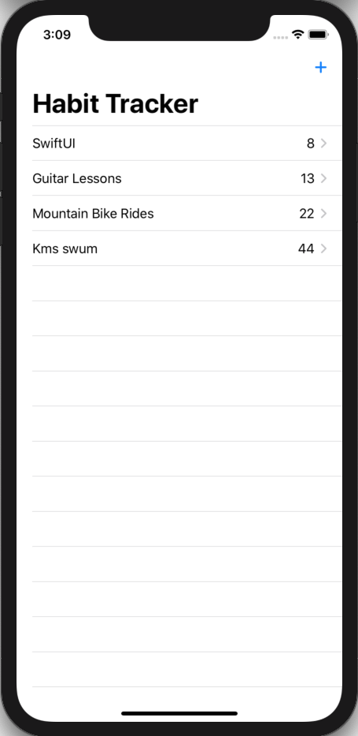
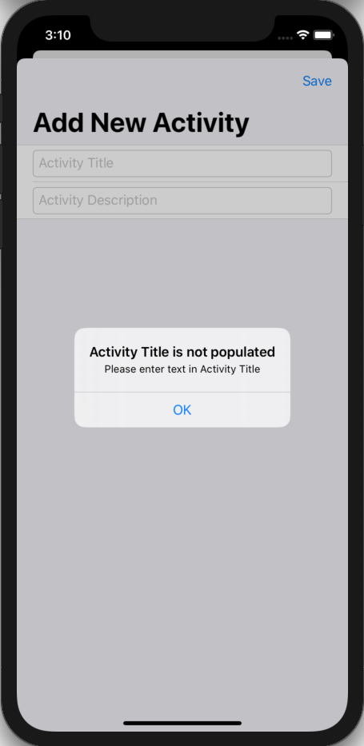
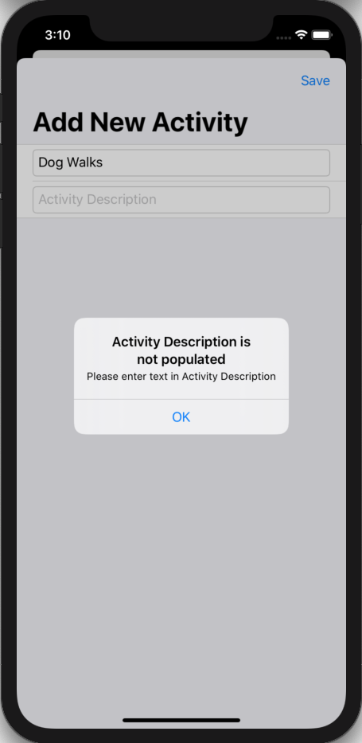
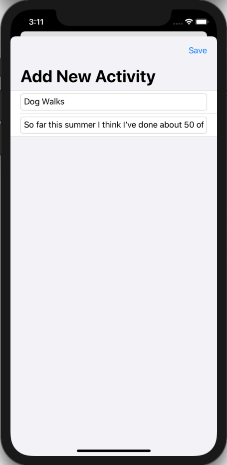
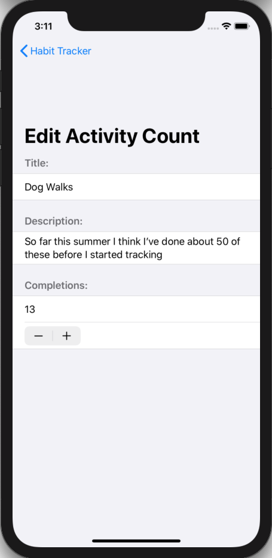
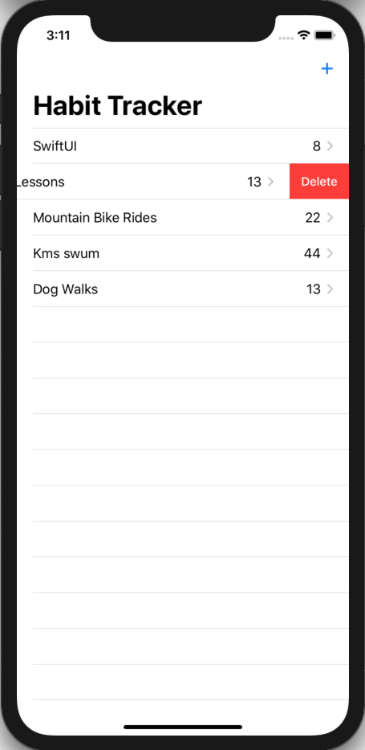

# 100 Days of SwiftUI Project 10

## Habit Tracker

**App Description:**  App to track the number of times the user has completed certain activities.

**Swift Features Used:**
ObservableObject, @Published, Identifiable, sheet, UserDefaults for persistence, NavigationLink, Codable, onDelete(perform:), ForEach, first(where:).

**Screenshots:**

